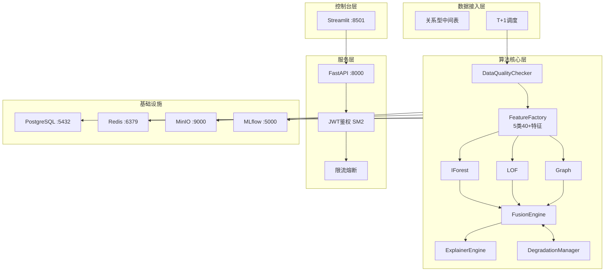

# ADR-001: CAD系统架构设计

**文档编号**: CAD-ADR-001 | **版本**: 1.0 | **日期**: 2026-05-18 | **状态**: 已接受

## 1. 上下文与需求

**系统背景**: CAD (Capital Anomaly Detection) 是企业级资金异常检测系统，为集团资金风控提供算法模型能力，通过 REST API 与现有 Java 系统集成。

**关键需求**:
- 性能: T+1批量处理，3万笔/日，峰值10万笔
- 算法: IForest、LOF、Graph三种异常检测模型
- 集成: Java系统通过REST API调用
- 合规: 等保2.0三级，国密SM2/SM3/SM4，36个月审计
- 角色: 管理员、分析师、审计员三角色

## 2. 架构决策 (ADRs)

### ADR-001: 采用模块化单块架构

**决策**: 采用模块化单块架构 (Modular Monolith)，各算法模块独立打包但统一部署

**理由**:
- 降低分布式系统复杂度，模块间数据传递本地调用更高效
- 支持独立Repository单独测试和版本发布
- 团队规模不需要微服务运维复杂度

### ADR-002: Phase-Based融合引擎

**融合公式**:
```
if rule_hit:
    final = max(rule_score, rule_score * rw + asc * aw)
else:
    final = asc
```

| 阶段 | 规则权重 | 算法权重 | 说明 |
|-----|---------|---------|-----|
| gray | 0.85 | 0.15 | 规则主导 |
| validation | 0.70 | 0.30 | 算法权重上升 |
| stable | 0.60 | 0.40 | 算法主导 |

### ADR-003: 四级自动降级

| 级别 | 条件 | 行为 |
|-----|-----|-----|
| full | 全部正常 | 3模型参与 |
| partial | 1-2个失败 | 剩余继续 |
| rules_only | 3个全失败 | 仅规则兜底 |
| blocked | 规则也失败 | 服务不可用 |

## 3. Mermaid架构图



## 4. 模块职责

| 模块 | 职责 |
|-----|------|
| `cad-data-quality` | 数据探查、必填/类型/范围校验 |
| `cad-feature-engine` | 5类40+特征计算、版本管理 |
| `cad-model-pool` | IForest/LOF/Graph推理、版本管理 |
| `cad-fusion-engine` | 规则算法融合、phase权重、风险分级 |
| `cad-explainer` | SHAP/LIME解释、业务语义映射 |
| `cad-degradation` | 模型健康监控、自动降级、Redis持久化 |
| `cad-service` | REST API、鉴权、业务编排 |
| `cad-console` | Streamlit控制台(4页) |

## 5. 数据模型

| 表名 | 用途 |
|-----|------|
| `cad_alert` | 预警结果 |
| `cad_feedback` | 复核反馈 |
| `cad_model_version` | 模型版本 |
| `cad_lineage` | 数据血缘 |
| `cad_audit_log` | 审计日志(36个月) |

## 6. API契约

| 端点 | 方法 | 用途 |
|-----|------|------|
| `/api/v1/detect/batch` | POST | T+1批量检测 |
| `/api/v1/explain/{txn_id}` | GET | 异常解释 |
| `/api/v1/feedback` | POST | 复核反馈 |
| `/api/v1/models` | GET | 模型列表 |
| `/api/v1/models/{name}/deploy` | POST | 发布模型 |
| `/api/v1/health` | GET | 健康检查 |

**错误码**: CAD-001(400) ~ CAD-021(503)

## 7. 合规设计

- **等保2.0三级**: JWT+SM2鉴权, RBAC, 36个月审计日志
- **国密**: SM2签名, SM4加密, SM3校验
- **数据脱敏**: 银行账号前4后4
